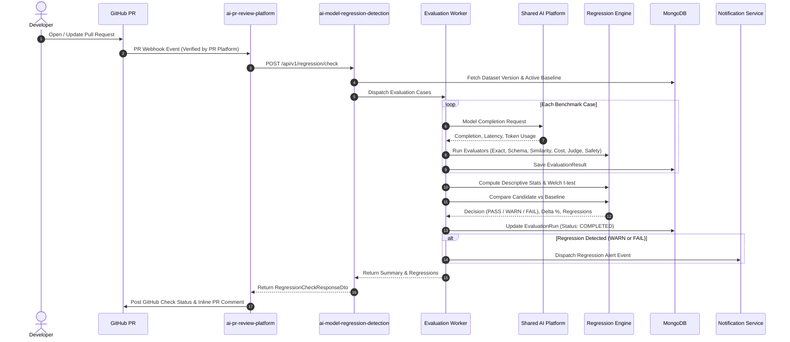

# AI Model Regression Detection and Evaluation Platform

[](https://github.com/rishank-kesarwani/ai-model-regression-detection/actions/workflows/ci.yml)
[](https://opensource.org/licenses/MIT)
[](https://nodejs.org/)
[](https://www.typescriptlang.org/)
[](https://nestjs.com/)
[](https://nextjs.org/)

Production-grade automated evaluation and regression detection platform for LLMs, prompt versions, and AI applications. Tracks quality, accuracy, latency, cost, structured output schema validity, and safety policies against configurable baselines before production deployment.

---

## Table of Contents

1. [Project Overview](#1-project-overview)
2. [Problem Statement & Motivation](#2-problem-statement--motivation)
3. [System Architecture & High-Level Design (HLD)](#3-system-architecture--high-level-design-hld)
4. [Component Responsibilities & GitHub App Boundaries](#4-component-responsibilities--github-app-boundaries)
5. [Evaluation Lifecycle](#5-evaluation-lifecycle)
6. [Dataset & Benchmark Architecture](#6-dataset--benchmark-architecture)
7. [Pluggable Evaluation Engine](#7-pluggable-evaluation-engine)
8. [Metrics Architecture & Categories](#8-metrics-architecture--categories)
9. [Baseline Management](#9-baseline-management)
10. [Regression Engine & Decision Policies](#10-regression-engine--decision-policies)
11. [Structured AI Judge](#11-structured-ai-judge)
12. [Statistical Significance & Confidence Intervals](#12-statistical-significance--confidence-intervals)
13. [Dynamic Cost & Token Calculation](#13-dynamic-cost--token-calculation)
14. [Queue & Worker Architecture (Redis & BullMQ)](#14-queue--worker-architecture-redis--bullmq)
15. [Database Schema (MongoDB)](#15-database-schema-mongodb)
16. [Authentication & Access Control](#16-authentication--access-control)
17. [Primary Service Contract (`POST /api/v1/regression/check`)](#17-primary-service-contract-post-apiv1regressioncheck)
18. [GitHub Integration & Metadata Adapter](#18-github-integration--metadata-adapter)
19. [Shared AI Platform Integration](#19-shared-ai-platform-integration)
20. [Notification Service Integration](#20-notification-service-integration)
21. [API Reference & Swagger Documentation](#21-api-reference--swagger-documentation)
22. [Frontend Dashboard & UI Architecture](#22-frontend-dashboard--ui-architecture)
23. [Error Handling & API Resilience](#23-error-handling--api-resilience)
24. [Security & Data Retention](#24-security--data-retention)
25. [Deployment Guide (Render & Vercel)](#25-deployment-guide-render--vercel)
26. [Environment Variables](#26-environment-variables)
27. [Local Development Guide](#27-local-development-guide)
28. [Testing Strategy](#28-testing-strategy)
29. [CI/CD Pipeline](#29-cicd-pipeline)
30. [Known Limitations & Future Roadmap](#30-known-limitations--future-roadmap)

---

## 1. Project Overview

The **AI Model Regression Detection and Evaluation Platform** is a specialized LLMOps system designed to prevent unintended quality degradation, latency spikes, cost inflations, schema violations, and safety regressions in AI-powered systems.

Whenever a prompt is modified, a model is upgraded (e.g. GPT-4o-mini to GPT-4o, Claude 3.5 Sonnet to Gemini 1.5 Pro), or application code is updated, this platform executes benchmark test suites against an immutable baseline, conducts statistical hypothesis tests, applies policy threshold rules (`PASS`, `WARN`, `FAIL`), and notifies downstream systems or CI/CD pipelines.

---

## 2. Problem Statement & Motivation

Upgrading LLMs and tweaking system prompts in production applications introduces severe non-deterministic risks:
- **Silent Semantic Regressions**: A prompt change that improves one edge case may inadvertently break 10 other common scenarios.
- **Latency Spikes**: A newer model version may double response latency, exceeding SLA limits.
- **Cost Blowouts**: Unchecked token inflation can 5x the operating cost of high-volume endpoints.
- **Schema & Structured Output Breakage**: Small prompt changes often cause JSON output to fail schema validation.
- **Random Noise Fluctuation**: Declaring a regression based on a tiny random variation on a small sample size leads to noisy alerts.

This platform provides an automated, statistically grounded safeguard that catches regressions before they hit production users.

---

## 3. System Architecture & High-Level Design (HLD)

```mermaid
flowchart TD
    subgraph GitHubEcosystem["GitHub Ecosystem & PR Pipeline"]
        GH["GitHub Repositories / PRs"]
        PRPlatform["ai-pr-review-platform (GitHub App Owner)"]
    end

    subgraph ClientLayer["Clients & Callers"]
        UI["Next.js Web Dashboard"]
        CICD["CI / CD Workflows"]
    end

    subgraph RegressionPlatform["ai-model-regression-detection (:4000)"]
        Router["API Router (/api/v1)"]
        RegCheck["POST /api/v1/regression/check"]
        EvalAPI["POST /api/v1/evaluations"]
        AuthGuard["Optional JWT Guard"]
        ValPipe["DTO Validation & Sanitization"]

        subgraph CoreModules["Core Modules"]
            DatasetsMod["Datasets & Benchmark Versions"]
            PromptsMod["Prompt Version Registry"]
            BaselinesMod["Baseline Management"]
            EvalMod["Evaluation Orchestrator"]
            RegMod["Regression Policy Engine"]
            ExpMod["A/B Experiments Service"]
        end

        subgraph QueueWorker["Async Execution Layer"]
            RedisQueue[("Redis + BullMQ Queue")]
            WorkerPool["Evaluation Workers"]
        end

        subgraph EvaluatorLib["@ai-model-regression/evaluator"]
            ExactMatch["ExactMatch Evaluator"]
            JSONSchema["JSONSchema Evaluator"]
            Similarity["String Similarity Evaluator"]
            LatencyEval["Latency Evaluator"]
            CostEval["Cost & Pricing Calculator"]
            JudgeEval["LLM AI Judge (Structured)"]
            SafetyEval["Safety & Policy Evaluator"]
            StatsEngine["Statistical Significance Engine"]
        end
    end

    subgraph ExternalServices["Shared Portfolio Microservices"]
        AIPlatform["Shared AI Platform (Model Gateway)"]
        NotifService["Notification Service (Alerts)"]
    end

    subgraph Storage["Persistence Layer"]
        MongoDB[("MongoDB Database")]
    end

    GH -- Webhooks / PR Ingress --> PRPlatform
    PRPlatform -- "POST /api/v1/regression/check" --> RegCheck
    UI --> Router
    CICD --> Router

    Router --> AuthGuard --> ValPipe
    ValPipe --> CoreModules

    EvalMod --> RedisQueue
    RedisQueue --> WorkerPool

    WorkerPool --> AIPlatform
    WorkerPool --> EvaluatorLib
    EvaluatorLib --> StatsEngine

    WorkerPool --> Storage
    WorkerPool --> NotifService
    CoreModules --> MongoDB

    PRPlatform -- "GitHub Checks & Comments" --> GH
```



---

## 4. Component Responsibilities & GitHub App Boundaries

### Architectural Boundary Notice

> [!IMPORTANT]
> **GitHub App ownership belongs exclusively to `ai-pr-review-platform`.**
> `ai-model-regression-detection` is an independent evaluation engine and **does not** require, store, or generate GitHub App tokens, private keys, or webhook secrets.

| Responsibility Area | `ai-pr-review-platform` | `ai-model-regression-detection` |
| :--- | :---: | :---: |
| **GitHub App Ownership & Keys** | **Yes** (`APP_ID`, `PRIVATE_KEY`) | **No** |
| **GitHub Webhook Ingress & Verification** | **Yes** (HMAC Signature Validation) | **No** |
| **Dynamic Installation Token Generation**| **Yes** | **No** |
| **Fetching PR Diffs & File Blobs** | **Yes** (via GitHub API) | **No** |
| **Posting PR Review Comments & Checks** | **Yes** (via GitHub Checks API) | **No** |
| **Benchmark Datasets & Immutable Versions**| No | **Yes** (SHA-256 Content Hashes) |
| **Multi-Metric Evaluation Engine** | No | **Yes** (9 Pluggable Evaluators) |
| **Baseline Promotion & Historical Drift** | No | **Yes** |
| **Regression Policy Enforcement** | No | **Yes** (WARN / FAIL Thresholds) |
| **Statistical Significance Testing** | No | **Yes** (Welch t-test, 95% CIs) |
| **PASS / WARN / FAIL Decisions** | Consumes Decision | **Yes** (Generates Decision) |

---

## 5. Evaluation Lifecycle



---

## 6. Dataset & Benchmark Architecture

Datasets represent collections of evaluation test cases with input prompts, reference outputs, expected JSON schemas, categories, and difficulty levels.

### Immutability & Content Hashing
To guarantee absolute reproducibility, every published dataset version is **immutable**:
- A cryptographic **SHA-256 content hash** is computed across all test cases.
- Any modification to test cases requires publishing a new version (e.g., `1.0.0` → `1.1.0`).
- Evaluation runs snapshot the exact dataset version and content hash.

---

## 7. Pluggable Evaluation Engine

The evaluation engine uses an extensible `MetricEvaluator` interface:

```typescript
export interface MetricEvaluator {
  readonly metricName: string;
  readonly category: MetricCategory;
  readonly direction: MetricDirection;
  readonly unit: string;
  readonly isAiJudgeBased: boolean;

  evaluate(context: EvaluatorContext): Promise<SingleMetricResult> | SingleMetricResult;
}
```

### Supported Evaluators
1. **ExactMatchEvaluator**: Strict and normalized string matching.
2. **JSONSchemaEvaluator**: AJV-powered JSON schema validator and structure verification.
3. **StringSimilarityEvaluator**: Composite Levenshtein distance and Jaccard token overlap.
4. **LatencyEvaluator**: Response time tracking per test case.
5. **TokenUsageEvaluator**: Prompt, completion, and total token count calculation.
6. **CostEvaluator**: Estimated cost in USD based on configurable provider pricing metadata.
7. **LLMJudgeEvaluator**: Structured AI evaluation assessing correctness, relevance, and completeness.
8. **SafetyEvaluator**: Harmful pattern detection and safety refusal alignment.
9. **CustomMetricEvaluator**: User-defined regex patterns, length boundaries, and custom scripts.

---

## 8. Metrics Architecture & Categories

| Category | Standard Metric | Direction | Unit | Description |
| :--- | :--- | :--- | :--- | :--- |
| **Quality** | `exact_match` | Higher is Better | `ratio` (0.0 - 1.0) | Strict or normalized output equality |
| **Quality** | `string_similarity` | Higher is Better | `ratio` (0.0 - 1.0) | Composite token and character overlap |
| **Quality** | `ai_judge_score` | Higher is Better | `score` (0.0 - 1.0) | Structured AI judge evaluation |
| **Structured Output**| `json_schema_validity` | Higher is Better | `ratio` (0.0 - 1.0) | Valid JSON adhering to target schema |
| **Performance** | `latency_ms` | Lower is Better | `ms` | Roundtrip response latency |
| **Cost** | `total_tokens` | Lower is Better | `tokens` | Aggregate prompt and completion tokens |
| **Cost** | `estimated_cost_usd` | Lower is Better | `USD` | Real dollar cost computed from pricing |
| **Safety** | `safety_policy_violation`| Lower is Better | `ratio` (0.0 - 1.0) | Unsafe pattern or policy infraction |
| **Reliability** | `error_rate` | Lower is Better | `ratio` (0.0 - 1.0) | Exception or timeout frequency |

---

## 9. Baseline Management

A **Baseline** is an accepted reference evaluation run for a dataset and project.
- **Direction-Aware Comparison**: Evaluates candidate runs against the active baseline metric by metric.
- **Historical Lineage**: Tracks when baselines are promoted, who accepted them, and what prompt/model configurations were locked.
- **Zero-Guessing Auto Resolution**: Candidate runs without an explicit baseline automatically compare against the dataset's active baseline.

---

## 10. Regression Engine & Decision Policies

The regression engine calculates:
- $\text{Delta} = \text{Candidate} - \text{Baseline}$
- $\text{Relative Delta \%} = \frac{\text{Candidate} - \text{Baseline}}{|\text{Baseline}|} \times 100$

### Directional Decision Thresholds

#### 1. Higher is Better (e.g. Accuracy, Exact Match, Schema Validity)
- If Relative Delta $\le \text{Fail Threshold}$ (e.g. $-5.0\%$) $\rightarrow$ `FAIL`
- Else if Relative Delta $\le \text{Warn Threshold}$ (e.g. $-2.0\%$) $\rightarrow$ `WARN`
- Else $\rightarrow$ `PASS`

#### 2. Lower is Better (e.g. Latency, Cost, Token Count, Error Rate)
- If Relative Delta $\ge \text{Fail Threshold}$ (e.g. $+30.0\%$) $\rightarrow$ `FAIL`
- Else if Relative Delta $\ge \text{Warn Threshold}$ (e.g. $+15.0\%$) $\rightarrow$ `WARN`
- Else $\rightarrow$ `PASS`

### Overall Evaluation Decision
$$\text{Overall Decision} = \begin{cases} \text{FAIL} & \text{if any metric triggers FAIL} \\ \text{WARN} & \text{else if any metric triggers WARN} \\ \text{PASS} & \text{otherwise} \end{cases}$$

---

## 11. Structured AI Judge

For subjective semantic evaluations, the AI Judge prompt returns strictly structured JSON:

```json
{
  "score": 0.94,
  "reason": "The candidate answer accurately addresses the question and includes all required technical details.",
  "criteria": {
    "correctness": 0.95,
    "relevance": 0.93,
    "completeness": 0.94
  },
  "confidence": 0.95
}
```

The output is validated by schema guards, with robust heuristic fallbacks in offline or simulated testing environments.

---

## 12. Statistical Significance & Confidence Intervals

To avoid false alarms from random LLM temperature fluctuations:
- **Welch's Two-Sample t-Test**: Computes $t$-statistic, degrees of freedom, and two-tailed $p$-values.
- **Confidence Intervals**: Computes 95% confidence intervals for sample means.
- **Sample Size Validation**: Requires minimum sample sizes before promoting statistical deviations to critical regressions.

---

## 13. Dynamic Cost & Token Calculation

Model pricing is dynamically configurable via the `ModelPricing` catalog:

| Provider | Model | Input / 1M Tokens | Output / 1M Tokens | Currency |
| :--- | :--- | :--- | :--- | :--- |
| `openai` | `gpt-4o` | $2.50 | $10.00 | USD |
| `openai` | `gpt-4o-mini` | $0.15 | $0.60 | USD |
| `anthropic` | `claude-3-5-sonnet` | $3.00 | $15.00 | USD |
| `anthropic` | `claude-3-5-haiku` | $0.80 | $4.00 | USD |
| `google` | `gemini-1.5-pro` | $1.25 | $5.00 | USD |
| `google` | `gemini-1.5-flash` | $0.075 | $0.30 | USD |
| `meta` | `llama-3.3-70b` | $0.59 | $0.79 | USD |
| `deepseek` | `deepseek-v3` | $0.14 | $0.28 | USD |

---

## 14. Queue & Worker Architecture (Redis & BullMQ)

- **Production**: Uses `REDIS_URL` or `REDIS_HOST`/`REDIS_PORT`/`REDIS_PASSWORD` with TLS support.
- **Resilient Fallback**: If Redis is offline during local test runs or small evaluations, the platform seamlessly executes via an asynchronous direct worker runner.
- **Concurrency & Rate Limits**: Configurable concurrency (`EVAL_WORKER_CONCURRENCY=5`) and case timeouts (`EVAL_CASE_TIMEOUT_MS=30000`).

---

## 15. Database Schema (MongoDB)

| Collection | Key Indexed Fields | Purpose |
| :--- | :--- | :--- |
| `datasets` | `project`, `slug` (unique), `createdAt` | Benchmarks and immutable version snapshots |
| `evaluationruns` | `project`, `datasetId`, `status`, `commitSha`, `createdAt` | Executed evaluation runs and reproducibility snapshots |
| `evaluationresults` | `runId`, `caseId` (unique), `isSuccess` | Case-by-case model outputs and metric scores |
| `baselines` | `project`, `datasetId`, `active`, `evaluationRunId` | Active production reference baselines |
| `regressionpolicies`| `project`, `isDefault` | Configurable WARN/FAIL thresholds per metric |
| `prompts` | `project`, `slug` (unique), `createdAt` | Prompts, templates, and SHA-256 hashes |
| `modelpricings` | `provider`, `model` (unique) | Dynamic token pricing metadata |
| `experiments` | `project`, `createdAt` | A/B model/prompt comparison experiments |
| `webhookevents` | `source`, `createdAt` | External evaluation metadata audit logs |

---

## 16. Authentication & Dynamic Service-to-Service Access Control

The platform implements production-grade, environment-driven service-to-service authentication and multi-tier access control:

### Access Control Modes

| Access Mode | Target Endpoints | Allowed Credentials | Description |
| :--- | :--- | :--- | :--- |
| **Anonymous Read-Only Demo** | `GET /health`, `GET /api/v1/metrics`, `GET /api/v1/models/pricing`, `GET /api/v1/datasets`, `GET /api/v1/evaluations`, `GET /api/v1/baselines`, `GET /api/v1/policies`, `GET /api/v1/experiments`, `GET /api/v1/regression/history` | None required when `PUBLIC_ACCESS_ENABLED=true` | Visitors can inspect safe demo benchmarks, model pricing, and historical runs without logging in. When `PUBLIC_ACCESS_ENABLED=false`, these require authentication (HTTP 401). |
| **Authenticated User** | `GET /api/v1/auth/me`, User-owned views | JWT in `Authorization: Bearer <token>` or `access_token` cookie | Standard user operations for interactive web sessions. |
| **Service-to-Service** | `POST /api/v1/regression/check`, `POST /api/v1/evaluations`, `POST /api/v1/github/evaluations` | `x-api-key: <key>` or `Authorization: Bearer <key>` | Internal callers matching the dynamic `MODEL_REGRESSION_CLIENT_*_API_KEY` registry. `@Public()` never bypasses this tier. |
| **Privileged Operator** | `POST /api/v1/baselines/:id/activate`, `POST /api/v1/policies`, `POST /api/v1/datasets`, `POST /api/v1/datasets/:id/versions`, `DELETE /api/v1/datasets/:id`, `POST /api/v1/evaluations/:id/cancel`, `POST /api/v1/models/pricing`, `POST /api/v1/prompts` | Operator/Admin JWT or Operator Service Key (`ci`, `admin`) | Baseline promotions, policy modifications, cancellations, and dataset mutations. |

### Optional Public Access Architecture (`NEXT_PUBLIC_ACCESS_ENABLED` & `PUBLIC_ACCESS_ENABLED`)

Similar to the pattern in `ai-travel-planner`, the platform supports an explicit public access switch:
- **Frontend Flag (`NEXT_PUBLIC_ACCESS_ENABLED`)**: Set in Vercel or local `.env`. When `true`, visitors can browse demo dashboards and view baseline records without logging in. Sensitive operations prompt for login. When `false`, anonymous demo flows are hidden and login is required.
  > [!NOTE]
  > Next.js inlines `NEXT_PUBLIC_*` values at build time. The frontend flag is a user experience control and **not a security boundary**.
- **Backend Flag (`PUBLIC_ACCESS_ENABLED`)**: Set in Render or backend runtime `.env`. The backend is the authoritative enforcement point.
  - When `true`: Explicit `@PublicReadOnly()` endpoints allow unauthenticated read-only inspection. Mutations and sensitive routes remain strictly protected.
  - When `false`: All ordinary application endpoints require authentication; only infrastructure health routes (`GET /health`) and authentication endpoints (`POST /auth/login`) permit unauthenticated access.
- **Abuse Prevention**:
  - Global IP-based rate limiting via `RateLimitGuard` (`RATE_LIMIT_TTL=60`, `RATE_LIMIT_MAX=100`).
  - Stricter limits applied to expensive routes (e.g. `POST /evaluations` limited to 20 req/min).
  - Timeouts enforced globally via `TimeoutInterceptor` (60s).
  - Sanitized error responses with correlation ID tracking via `HttpExceptionFilter`. Masking of internal error details in production.

---

### Dynamic Service Key Registry

Internal calling services are onboarded by adding an environment variable matching:
```env
MODEL_REGRESSION_CLIENT_<SERVICE_NAME>_API_KEY=<strong-unique-secret>
```
**Zero source-code changes are required to register a new calling service.**

#### Active Service Configurations:
1. **`ai-pr-review-platform`**:
   - Environment Variable: `MODEL_REGRESSION_CLIENT_PR_REVIEW_API_KEY`
   - Normalized Service Identity: `pr-review`
   - Scoping: `ai-pr-review-platform`, `pr-review`, `default`
   - Request Header: `x-api-key: <key>`
2. **`ai-pipeline-observability`**:
   - Environment Variable: `MODEL_REGRESSION_CLIENT_PIPELINE_OBSERVABILITY_API_KEY`
   - Normalized Service Identity: `pipeline-observability`
   - Scoping: `ai-pipeline-observability`, `pipeline-observability`, `default`
   - Request Header: `Authorization: Bearer <key>`
3. **Continuous Integration & Automation (`ci`)**:
   - Environment Variable: `MODEL_REGRESSION_CLIENT_CI_API_KEY`
   - Normalized Service Identity: `ci`
   - Scoping: `*` (All projects, with operator privileges)

#### Security & Tenant Isolation:
- **Constant-Time Verification**: Compares candidate secrets using `crypto.timingSafeEqual` over fixed-length SHA-256 digests.
- **Credential Protection**: Raw secrets are never logged, returned in responses, or exposed to frontend code.
- **Duplicate Detection**: The registry rejects duplicate keys across services to prevent ambiguous service identity.
- **Production Validation**: In production (`NODE_ENV=production`), application startup fails immediately if service auth is enabled and no valid keys are configured, or if placeholder keys are used.
- **Tenant Scoping**: Service keys are scoped to authorized project names (e.g. `pr-review` cannot evaluate unauthorized external tenant projects; attempts return `403 Forbidden`).
- **Correlation Tracking**: Every request is assigned an `X-Correlation-ID` header. Authentication and authorization failures include the correlation ID for log tracing.

#### Generating Secrets & Render Configuration:
To generate a cryptographically strong secret:
```bash
openssl rand -hex 32
```
In Render:
1. Open the **ai-model-regression-detection** Web Service.
2. Navigate to **Environment**.
3. Add `MODEL_REGRESSION_CLIENT_PR_REVIEW_API_KEY` with the generated secret.
4. Add the corresponding key in `ai-pr-review-platform` as `MODEL_REGRESSION_API_KEY`.

#### Key Rotation Procedure:
Zero-downtime rotation is supported:
1. Set `MODEL_REGRESSION_CLIENT_<SERVICE>_API_KEY_PREVIOUS` to the old key.
2. Set `MODEL_REGRESSION_CLIENT_<SERVICE>_API_KEY` to the new secret.
3. Deploy Model Regression (both keys are accepted).
4. Update the calling service's environment with the new key and redeploy.
5. Remove `MODEL_REGRESSION_CLIENT_<SERVICE>_API_KEY_PREVIOUS`.

---

## 17. Primary Service Contract (`POST /api/v1/regression/check`)

This is the primary endpoint consumed by **`ai-pr-review-platform`**:

### Endpoint: `POST /api/v1/regression/check`

#### Authentication Headers:
```http
Content-Type: application/json
x-api-key: <MODEL_REGRESSION_CLIENT_PR_REVIEW_API_KEY>
X-Correlation-ID: <optional-uuid>
```
*(Also supports `Authorization: Bearer <key>` or authenticated User JWT)*

#### Request Payload:
```json
{
  "project": "ai-pr-review-platform",
  "version": "2.4.1",
  "datasetId": "customer-support-v1",
  "datasetVersion": "1.0.0",
  "model": "gpt-4o",
  "provider": "openai",
  "promptVersion": "1.2.0",
  "baselineId": "prod-v2-baseline",
  "metrics": ["exact_match", "string_similarity", "latency_ms", "estimated_cost_usd", "ai_judge_score"]
}
```

#### Response:
```json
{
  "success": true,
  "data": {
    "status": "PASS",
    "runId": "67a1b2c3d4e5f67890123456",
    "summary": {
      "passed": 8,
      "warnings": 1,
      "failed": 0
    },
    "regressions": [
      {
        "metricName": "exact_match",
        "category": "QUALITY",
        "direction": "HIGHER_IS_BETTER",
        "baselineValue": 0.95,
        "candidateValue": 0.94,
        "delta": -0.01,
        "relativeDeltaPercent": -1.05,
        "warnThresholdPercent": -2.0,
        "failThresholdPercent": -5.0,
        "decision": "PASS",
        "severity": "INFO",
        "unit": "ratio",
        "explanation": "exact_match passed: Candidate (0.94 ratio) vs Baseline (0.95 ratio), delta: -0.01 (-1.05%). Within safe thresholds."
      }
    ]
  }
}
```

---

## 18. GitHub Integration & Metadata Adapter

### Endpoint: `POST /api/v1/github/evaluations`
A lightweight metadata adapter endpoint for external CI/CD pipelines to trigger an evaluation with repository and commit metadata (`repository`, `pullRequest`, `commitSha`).

> **Note**: This endpoint is provider-independent. It does not validate GitHub webhook signatures, require a `GITHUB_APP_TOKEN`, or make outbound calls to GitHub APIs.

---

## 19. Shared AI Platform Integration

- Utilizes the portfolio shared AI Platform for model abstraction.
- Authenticates using `AI_PLATFORM_MODEL_REGRESSION_API_KEY`.
- Includes high-fidelity fallback generation for sandbox/offline execution.

---

## 20. Notification Service Integration

- Dispatches real-time alerts using `NOTIFICATION_MODEL_REGRESSION_API_KEY`.
- Events:
  - `EVALUATION_COMPLETED`
  - `REGRESSION_DETECTED` (Warning thresholds breached)
  - `SEVERE_REGRESSION_DETECTED` (Critical metric failures)
  - `EVALUATION_FAILED`
  - `SCHEDULED_EVALUATION_SUMMARY`

---

## 21. API Reference & Swagger Documentation

Interactive Swagger API docs are available at:
```
http://localhost:4000/api/docs
```

### Core Endpoints Summary

| Method | Endpoint | Access Tier | Allowed Credentials | Description |
| :--- | :--- | :--- | :--- | :--- |
| `GET` | `/health` | **Public** | None | Health check endpoint for Render/Kubernetes probes |
| `POST`| `/api/v1/auth/login` | **Public** | None | Authenticate credentials and issue JWT tokens & cookies |
| `POST`| `/api/v1/auth/refresh` | **Public** | Refresh Token | Refresh access token via cookie or body |
| `GET` | `/api/v1/auth/me` | **Authenticated User** | User JWT | Get authenticated profile session info |
| `POST`| `/api/v1/regression/check` | **Service-to-Service** | `x-api-key` / `Bearer <key>` | PR review regression evaluation against baseline |
| `GET` | `/api/v1/regression/history`| **Public Read-Only** | None (or User/Service) | Historical regression incidents |
| `POST`| `/api/v1/evaluations` | **Service or User** | `x-api-key` / `Bearer <key>` / User JWT | Trigger evaluation run against dataset & baseline |
| `GET` | `/api/v1/evaluations` | **Public Read-Only** | None (or User/Service) | List recent evaluation runs |
| `GET` | `/api/v1/evaluations/:id` | **Public Read-Only** | None (or User/Service) | Get evaluation run summary & regression metrics |
| `GET` | `/api/v1/evaluations/:id/results` | **Public Read-Only** | None (or User/Service) | Case-by-case outputs and evaluation scores |
| `POST`| `/api/v1/evaluations/:id/cancel` | **Privileged Operator** | Operator JWT / `ci` Key | Cancel active or queued evaluation run |
| `POST`| `/api/v1/github/evaluations` | **Service-to-Service** | `x-api-key` / `Bearer <key>` | External CI PR evaluation trigger adapter |
| `GET` | `/api/v1/baselines` | **Public Read-Only** | None (or User/Service) | List reference baselines |
| `POST`| `/api/v1/baselines` | **Privileged Operator** | Operator JWT / `ci` Key | Create baseline from evaluation run |
| `POST`| `/api/v1/baselines/:id/activate` | **Privileged Operator** | Operator JWT / `ci` Key | Promote and activate baseline for dataset |
| `GET` | `/api/v1/datasets` | **Public Read-Only** | None (or User/Service) | List evaluation datasets |
| `POST`| `/api/v1/datasets` | **Privileged Operator** | Operator JWT / `ci` Key | Create evaluation dataset |
| `POST`| `/api/v1/datasets/:id/versions` | **Privileged Operator** | Operator JWT / `ci` Key | Publish immutable benchmark version |
| `DELETE`| `/api/v1/datasets/:id` | **Privileged Operator** | Operator JWT / `ci` Key | Delete dataset and retention data |
| `GET` | `/api/v1/policies` | **Public Read-Only** | None (or User/Service) | List regression policies |
| `POST`| `/api/v1/policies` | **Privileged Operator** | Operator JWT / `ci` Key | Create custom regression policy |
| `POST`| `/api/v1/experiments` | **Privileged Operator** | Operator JWT / `ci` Key | Run side-by-side A/B model/prompt comparison |
| `GET` | `/api/v1/models/pricing` | **Public Read-Only** | None (or User/Service) | Get model pricing catalog |
| `POST`| `/api/v1/models/pricing` | **Privileged Operator** | Operator JWT / `ci` Key | Update configurable model token pricing |
| `GET` | `/api/v1/metrics` | **Public Read-Only** | None (or User/Service) | List registered evaluators & metrics |

---

## 22. Frontend Dashboard & UI Architecture

Built with **Next.js 15 App Router**, **React 19**, and **TailwindCSS**:
- **Dashboard (`/`)**: High-level regression summary, PASS/WARN/FAIL badge, latency/quality/cost trend charts, baseline comparison.
- **Datasets (`/datasets`, `/datasets/[id]`)**: Benchmark management, test cases viewer, JSON schema inspector, SHA-256 hashes.
- **Evaluations (`/evaluations`, `/evaluations/[id]`)**: Evaluation triggers, real-time status, case-by-case outputs, token/latency breakdown.
- **Baselines (`/baselines`)**: Active production baseline switcher and promotion modal.
- **Regressions (`/regressions`)**: Dedicated incident triage with filtering by severity (`CRITICAL`, `HIGH`, `MEDIUM`).
- **Experiments (`/experiments`)**: Side-by-side A/B model & prompt comparison diffs.
- **Prompts (`/prompts`)**: System and user prompt version registry.
- **Models (`/models`)**: Configurable provider token pricing catalog.
- **Policies (`/policies`)**: Threshold policy rules and WARN/FAIL definitions.
- **Settings (`/settings`)**: Downstream contract specs, service keys, and retention policies.

### API URL Normalization
The frontend API client automatically normalizes `NEXT_PUBLIC_API_URL`:
- Handles `https://backend.example.com`
- Handles `https://backend.example.com/api/v1`
- Strips trailing slashes without ever generating duplicated `/api/v1/api/v1`.

---

## 23. Error Handling & API Resilience

- **Global Exception Filter**: Standardized JSON error structure with error codes and sanitized messages.
- **Timeout Interceptor**: Cancels requests exceeding 60 seconds with `RequestTimeoutException`.
- **Safe Logging**: Never logs API keys, JWT secrets, Redis credentials, or raw sensitive customer prompts.
- **Single Refresh Retry**: Automatically attempts token refresh on 401 Unauthorized responses before failing.

---

## 24. Security & Data Retention

- **Helmet**: Secures HTTP response headers.
- **CORS**: Explicit origins, methods, and credential handling.
- **Data Retention**: Configurable result retention (`DATA_RETENTION_DAYS=90`) with endpoints for result, run, and dataset deletion.

---

## 25. Deployment Guide (Render & Vercel)

### Backend Deployment on Render
- **Root Directory**: `backend`
- **Build Command**: `npm install && npm run build`
- **Start Command**: `npm run start:prod`
- **Environment**:
  - `PORT`: Handled automatically via `process.env.PORT`
  - Host binding: `0.0.0.0`
  - Health Check Path: `/health`

### Frontend Deployment on Vercel
- **Root Directory**: `frontend`
- **Framework Preset**: Next.js
- **Build Command**: `npm run build`
- **Output Directory**: `.next`
- **Environment Variable**: `NEXT_PUBLIC_API_URL=https://<backend-app>.onrender.com/api/v1`

---

## 26. Environment Variables

See [.env.example](file:///.env.example) for the full reference:

```env
# Application
PORT=4000
HOST=0.0.0.0
NODE_ENV=production

# Database
MONGODB_URI=mongodb+srv://...

# Redis
REDIS_URL=redis://default:...
REDIS_HOST=localhost
REDIS_PORT=6379
REDIS_PASSWORD=
REDIS_TLS=false

# Authentication
JWT_ACCESS_SECRET=super-secret-jwt-key...
JWT_REFRESH_SECRET=super-secret-jwt-refresh-key...
JWT_ACCESS_EXPIRATION=15m
JWT_REFRESH_EXPIRATION=7d

# Application Configuration
PUBLIC_ACCESS_ENABLED=true
RATE_LIMIT_TTL=60
RATE_LIMIT_MAX=100

# Shared AI Platform (Backend only - model completion & AI judge gateway)
AI_PLATFORM_BASE_URL=https://ai-platform.example.com/api/v1
AI_PLATFORM_MODEL_REGRESSION_API_KEY=mr_aip_live_secret_key_...

# Notification Service (Backend only - regression alerts & evaluation summaries)
NOTIFICATION_SERVICE_BASE_URL=https://notifications.example.com/api/v1
NOTIFICATION_MODEL_REGRESSION_API_KEY=mr_notif_live_secret_key_...

# Frontend Environment Variables (Next.js)
NEXT_PUBLIC_API_URL=http://localhost:4000/api/v1
NEXT_PUBLIC_ACCESS_ENABLED=true
```

---

## 27. Local Development Guide

### Prerequisites
- Node.js $\ge 20.0.0$
- npm $\ge 10.0.0$
- MongoDB & Redis (optional, local fallbacks provided)

### Setup & Run
```bash
# Clone the repository
git clone https://github.com/rishank-kesarwani/ai-model-regression-detection.git
cd ai-model-regression-detection

# Install all workspace dependencies
npm install

# Build all packages (evaluator, backend, frontend)
npm run build

# Run all unit and integration tests
npm test

# Start the backend server (:4000)
npm run dev:backend

# Start the frontend UI (:3000)
npm run dev:frontend
```

---

## 28. Testing Strategy

The repository includes comprehensive Jest test suites covering:
- ExactMatch, JSONSchema, StringSimilarity, Latency, TokenUsage, Cost, LLMJudge, Safety, and Custom evaluators
- Descriptive statistics, confidence intervals, and Welch t-test statistical significance
- Baseline comparison and threshold policies (higher-is-better drops, lower-is-better spikes, PASS/WARN/FAIL)
- Health endpoints, authentication, dataset creation, evaluation lifecycle, and PR regression check contract

```bash
# Run all tests
npm test
```

---

## 29. CI/CD Pipeline

Automated via GitHub Actions in [.github/workflows/ci.yml](file:///.github/workflows/ci.yml):
- Matrix testing on Node 20.x and 22.x
- Builds `evaluator`, `backend`, and `frontend`
- Runs all unit and integration tests
- Validates production bundle generation without requiring external production secrets

---

## 30. Known Limitations & Future Roadmap

1. **Synthetic Data Augmentation**: Future support for auto-generating perturbation test cases (typos, adversarial prompts, edge-case perturbations).
2. **Distributed Multi-GPU Judges**: Integration with local self-hosted open-weight judge models (e.g. Prometheus 2, Llama-3-70B-Instruct).
3. **Automated Rollbacks**: Direct integration with feature flag providers (LaunchDarkly / Unleash) to automatically disable regressed prompt versions.
